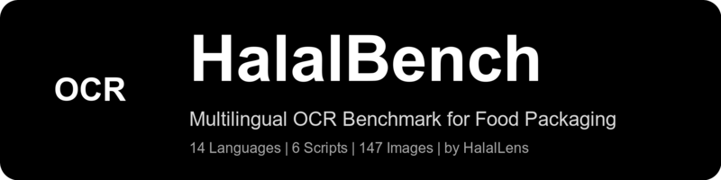

<p align="center">
  
</p>

<h1 align="center">HalalBench</h1>

<p align="center">
  <strong>A Multilingual OCR Benchmark for Food Packaging Ingredient Extraction</strong>
</p>

<p align="center">
  <a href="https://arxiv.org/abs/XXXX.XXXXX"></a>
  <a href="https://doi.org/10.5281/zenodo.18674795"></a>
  <a href="LICENSE"></a>
  <a href="LICENSE"></a>
  <a href="https://www.python.org/downloads/"></a>
</p>

---

**HalalBench** is the first large-scale, multilingual benchmark for evaluating OCR engines on real-world food packaging images. It addresses a critical gap in OCR evaluation: existing benchmarks focus on documents, scenes, or handwriting, but none target the curved, multilingual, low-contrast text found on ingredient labels.

## Quick Stats

| Metric | Value |
|--------|-------|
| Total images | **1,043** |
| Total annotations | **36,438** |
| Languages | **14** |
| OCR engines evaluated | **4** |
| Annotation format | COCO |

## Key Results

We evaluate four OCR engines across all 14 languages and report macro-averaged F1 scores:

| Engine | Exact F1 | Fuzzy F1 (d<=2) | Catastrophic Rate |
|--------|----------|------------------|-------------------|
| **ML Kit** | **0.487** | **0.546** | **0.312** |
| docTR | 0.465 | 0.519 | 0.341 |
| EasyOCR | 0.210 | 0.268 | 0.587 |
| RapidOCR | 0.189 | 0.243 | 0.614 |

No engine exceeds 0.55 fuzzy F1, confirming that food packaging OCR remains an unsolved problem.

## Languages

Arabic, Danish, Dutch, English, French, German, Indonesian, Japanese, Korean, Malay, Norwegian, Swedish, Thai, Turkish

## Getting Started

### Installation

```bash
git clone https://github.com/halallens-no/halalbench.git
cd halalbench
pip install -r benchmark/requirements.txt
```

### Download the Dataset

See [`data/README.md`](data/README.md) for download instructions and format documentation.

### Run Evaluation

```bash
# Evaluate with pre-computed OCR predictions
python benchmark/evaluate.py \
    --annotations data/annotations.json \
    --predictions predictions/mlkit_predictions.json \
    --output results/

# Compute metrics only
python benchmark/evaluate.py \
    --annotations data/annotations.json \
    --predictions predictions/mlkit_predictions.json \
    --metrics-only
```

## Repository Structure

```
halalbench/
  benchmark/
    evaluate.py          # Main evaluation script
    metrics.py           # F1, fuzzy F1, catastrophic rate
    requirements.txt     # Python dependencies
  data/
    README.md            # Dataset documentation
    annotations.json     # COCO-format ground truth (after download)
  assets/
    halalbench-logo.png  # Logo
  LICENSE                # MIT (code) + CC BY-SA 4.0 (dataset)
  README.md              # This file
```

## Citation

If you use HalalBench in your research, please cite:

```bibtex
@article{halalbench2026,
  title     = {HalalBench: A Multilingual OCR Benchmark for Food Packaging Ingredient Extraction},
  author    = {HalalLens Research},
  journal   = {arXiv preprint arXiv:XXXX.XXXXX},
  year      = {2026},
  url       = {https://arxiv.org/abs/XXXX.XXXXX}
}
```

## License

- **Code** (benchmark scripts, evaluation tools): [MIT License](LICENSE)
- **Dataset** (images, annotations): [CC BY-SA 4.0](LICENSE)

See [LICENSE](LICENSE) for full terms.

## Links

- **HalalLens App**: [https://halallens.no](https://halallens.no)
- **Paper**: [arXiv:XXXX.XXXXX](https://arxiv.org/abs/XXXX.XXXXX)
- **Dataset (Zenodo)**: [doi:10.5281/zenodo.18674795](https://doi.org/10.5281/zenodo.18674795)
- **Dataset Download**: See [`data/README.md`](data/README.md)

---

<p align="center">
  Built by <strong>HalalLens Research</strong> &mdash; <a href="https://halallens.no">https://halallens.no</a>
</p>
